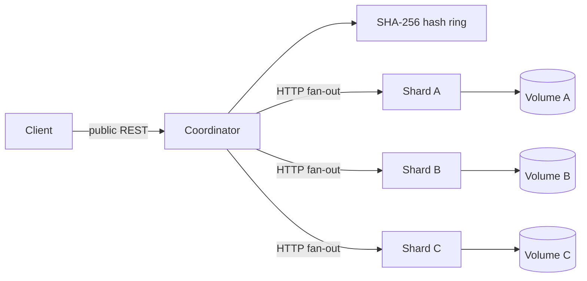

# Distributed Search Engine

A Java 17 and Spring Boot full-text search service with a coordinator and independent HTTP shard
nodes. Documents are placed with consistent hashing, each shard owns its own in-memory inverted
index and durable snapshot, and searches are ranked with corpus statistics gathered across the
cluster.

## Run the local cluster

Requirements:

- Docker with the Compose plugin
- Python 3 to run the end-to-end tests

Start one coordinator and three shard nodes:

```bash
docker compose up --build --detach
docker compose ps
```

The public API is available at `http://localhost:8080`. Compose waits for all shard health checks
before starting the coordinator. Each shard has a separate named volume, so its index survives a
container restart.

Index and search a document:

```bash
curl -X POST http://localhost:8080/api/index \
  -H "Content-Type: application/json" \
  -d '{"id":1,"content":"Distributed search uses independently persisted shards."}'

curl "http://localhost:8080/api/search?q=distributed%20search&limit=10"
```

Stop the cluster while retaining shard data:

```bash
docker compose down
```

Add `--volumes` to delete the local cluster's persisted index data.

## Architecture



### Coordinator and routing

The coordinator is the only public service. Its configured node registry creates a SHA-256
consistent hash ring with 128 virtual nodes per shard. Index, replacement, and deletion requests
hash the document ID and issue one HTTP request to the owning shard. A write is never silently sent
to a different shard when its owner is unavailable.

The Compose topology is static: `shard-a`, `shard-b`, and `shard-c` are independently configured
processes. Remote membership changes and data migration are not exposed as cluster operations.
The local in-process execution mode remains available when no remote nodes are configured, mainly
for standalone use and focused tests, but it is not a substitute for the Docker cluster.

### Two-phase global TF-IDF search

Search uses two concurrent fan-out phases:

1. The coordinator analyzes the query and asks every shard for its total document count and the
   document frequency of each query term.
2. It sums those responses into global corpus statistics, sends the statistics back to the
   responding shards, and asks each shard to score its matching documents.

Shard scores use term frequency from the local document and inverse document frequency from the
aggregated corpus. The coordinator merges all responses, orders them by descending score, breaks
ties by ascending document ID, and then applies the global top-K limit. Both fan-out phases use the
bounded coordinator worker pool, so slow shards do not serialize otherwise independent requests.

### Failure handling

Remote clients have explicit connection and request timeouts, and each fan-out phase has a common
coordinator deadline. A shard that fails the statistics phase is excluded from the scoring phase;
a shard that fails either phase is returned in `unavailableShards` and sets `partial` to `true`.
The coordinator still returns ranked results from shards that completed both phases.

For example, a degraded search response can look like:

```json
{
  "results": [
    {"id": 1, "content": "available result", "score": 0.5}
  ],
  "totalResults": 1,
  "partial": true,
  "unavailableShards": ["shard-b"]
}
```

Partial scores are based only on corpus statistics from responding shards. They are deterministic
for that response, but can differ from scores produced by the complete cluster. There is no
replication or failover owner, so documents on an unavailable shard cannot appear until it returns.
Index and delete failures are surfaced as request failures instead of being accepted as partial
writes.

### Persistence and containers

Each shard persists a versioned JSON manifest and document snapshot in its configured data
directory. Mutations are written before the shard reports success, using atomic replacement where
the filesystem supports it. On restart, the shard rebuilds its in-memory postings from its own
snapshot. The three Compose services mount different named volumes and reject persistence data
belonging to another shard ID.

The multi-stage Dockerfile builds the Spring Boot JAR with the Maven wrapper and copies only the JAR
and runtime prerequisites into the final Java 17 image. The application runs as the unprivileged
`searchengine` user (UID/GID 10001). Compose health checks cover the public coordinator health
endpoint and each shard's internal health endpoint.

## API

### `POST /api/index`

Creates or replaces one document. IDs must be positive; content must be non-blank and no more than
10,000 characters.

```json
{"id": 42, "content": "Replacement content removes the previous postings."}
```

### `GET /api/search`

| Parameter | Required | Constraints |
| --- | --- | --- |
| `q` | Yes | Non-blank, at most 500 characters |
| `limit` | No | Integer from 1 to 100 |

The response always includes `results`, `totalResults`, `partial`, and `unavailableShards`.

### `DELETE /api/documents/{id}`

Returns `204 No Content` after deletion or `404 Not Found` when the owning shard does not contain
the document.

### Operational endpoints

- `GET /api/status/shards` returns shard IDs and live document counts.
- `GET /actuator/health` reports coordinator process health.
- `GET /actuator/metrics` lists Micrometer metrics, including `searchengine.*` search and mutation
  meters.
- Shard-only protocol endpoints live under `/internal/shard` and are intended for the private
  cluster network.

Validation and application errors use one JSON shape:

```json
{
  "status": 400,
  "error": "Bad Request",
  "message": "Search query must not be blank",
  "path": "/api/search"
}
```

## Configuration

Spring Boot properties can be supplied in `application.properties`, as environment variables, or
as command-line arguments.

| Property | Default | Purpose |
| --- | --- | --- |
| `searchengine.coordinator.nodes[n].id` | none | Stable shard ID used by the hash ring |
| `searchengine.coordinator.nodes[n].url` | none | HTTP origin for that shard |
| `searchengine.coordinator.connect-timeout` | `2s` | Remote connection timeout |
| `searchengine.coordinator.search-timeout` | `5s` | Remote request and fan-out deadline |
| `searchengine.search.worker-count` | `8` | Coordinator fan-out worker count |
| `searchengine.search.shutdown-timeout` | `60s` | Worker shutdown grace period |
| `searchengine.shard-node.id` | `ShardA` | Identity of a `shard-node` profile process |
| `searchengine.persistence.directory` | `search-engine-data` | Shard snapshot directory |
| `searchengine.shard-count` | `2` | Shard count only in standalone local mode |

`docker-compose.yml` shows the complete environment-variable form for a three-node registry.

## Verification

Run the Java test and code-quality build:

```bash
./mvnw clean verify
```

Run the disposable healthy-cluster scenario. It builds and starts Compose, chooses document IDs
owned by all three shards, verifies global ranking and deletion, and removes its containers and
volumes in a `finally` block:

```bash
python scripts/cluster-smoke-test.py
```

Run the failure scenario. It stops `shard-b`, requires explicit partial-result metadata, restarts
the persisted node, and waits for complete results to recover:

```bash
python scripts/cluster-failure-test.py
```

Both scripts use an isolated Compose project name. Set `SMOKE_TIMEOUT_SECONDS`, `SMOKE_BASE_URL`, or
`COMPOSE_PROJECT_NAME` to override their defaults.

The reproducible JMeter workload and dataset setup are in
[`load-testing/README.md`](load-testing/README.md). No throughput or latency claim should be made
without recording the machine, dataset, concurrency, command, and output from an actual run.

## Tradeoffs and limitations

- The hash ring minimizes remapping in principle, but remote membership changes and rebalancing are
  not implemented as an online cluster operation.
- There is one copy of each document. The system provides explicit degraded reads, not high
  availability or replicated durability.
- Two network phases make TF-IDF globally consistent when all shards answer, at the cost of an
  additional round trip and sensitivity to the slowest shard before the deadline.
- Shards keep documents and postings in memory and rewrite document snapshots on mutation. This
  favors simple recovery semantics over write throughput and large datasets.
- `/api/status/shards` reads live counts and can fail when a shard is unavailable; search has richer
  partial-result semantics than the topology endpoint.
- The service has validation and metrics but no authentication, authorization, TLS termination,
  rate limiting, replication, leader election, or tenant isolation.
- Analysis provides deterministic token extraction and lowercasing, not stemming, stop words,
  phrases, fuzzy matching, or language-specific processing.
